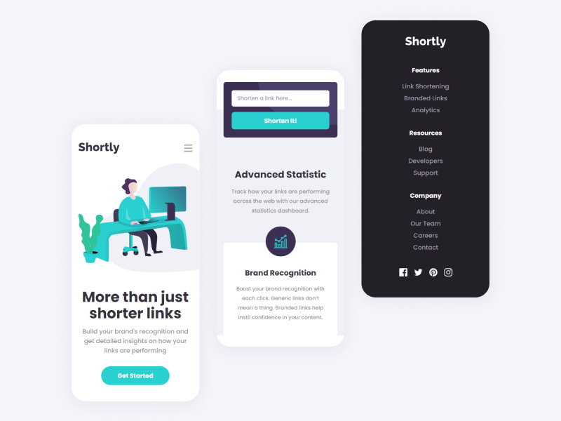

# Shortly URL shortening API Challenge solution

This is a solution to the [Shortly URL shortening API Challenge challenge on Frontend Mentor](https://www.frontendmentor.io/challenges/url-shortening-api-landing-page-2ce3ob-G).

## Table of contents

- [Shortly URL shortening API Challenge solution](#shortly-url-shortening-api-challenge-solution)
  - [Table of contents](#table-of-contents)
  - [Overview](#overview)
    - [The challenge](#the-challenge)
    - [Screenshot](#screenshot)
    - [Links](#links)
  - [My process](#my-process)
    - [Built with](#built-with)
  - [Author](#author)
  - [⚒ Usage](#-usage)
    - [👥 Clone the repo](#-clone-the-repo)
    - [📦 Install dependencies](#-install-dependencies)
    - [✨ Start/Run the app](#-startrun-the-app)

## Overview

### The challenge

Users should be able to:

- View the optimal layout for the site depending on their device's screen size
- Shorten any valid URL
- See a list of their shortened links, even after refreshing the browser
- Copy the shortened link to their clipboard in a single click
- Receive an error message when the `form` is submitted if:
  - The `input` field is empty

### Screenshot




### Links

- Solution URL: [Github](https://github.com/metkerr/url-shortening-api-landing-page.git)


- Live Site URL: [Live on Vercel](https://shortly-urls-shortening.vercel.app/)

## My process

### Built with

- Semantic HTML5 markup
- Flexbox
- Mobile-first workflow
- [React](https://reactjs.org/) - JS library
- [Tailwind](https://tailwindcss.com/) - For styles
- [SHRT Code API](https://shrtco.de/docs) - URL Shortener API

## Author

- Website - [Metker](https://metkerr.github.io/)
- Frontend Mentor - [@metkerr](https://www.frontendmentor.io/profile/metkerr)
- Twitter - [@metkerr](https://twitter.com/metkerr)

## ⚒ Usage
 ### 👥 Clone the repo

 ```shell
 $ git clone https://github.com/metkerr/url-shortening-api-landing-page.git
 ```

### 📦 Install dependencies
```shell
$ cd url-shortening-api-landing-page
$ npm install
```

### ✨ Start/Run the app
```shell
$ npm start
```